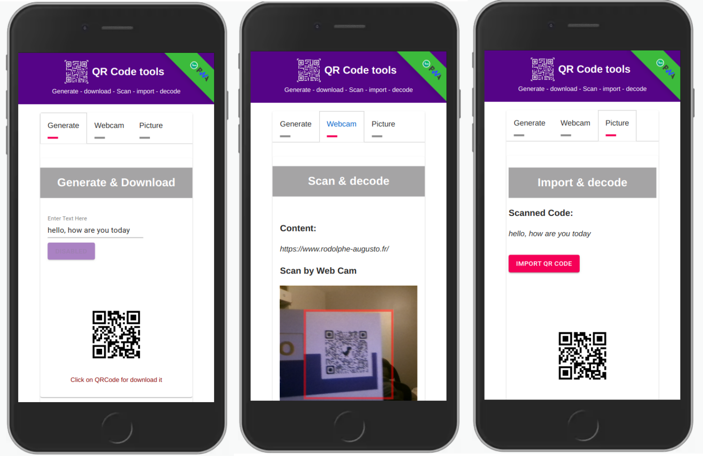

---

# QRCode Tools

>This app is ***free to use*** &
the code is ***open sources***!

---

## :computer: Online Demo

**You can use this app** **[here](https://qr-code-tools.netlify.app/)**

---

### :bookmark: What is QRCode Tools?

>QRCode Tools is a complete and fast tool to:
>- Generate your QrCode and then download it!
>- Scan a QrCode directly with your camera then read it "on the fly".
>- Import a QrCode from your hard drive and read it "on the fly".

---

**:heavy_exclamation_mark: Progressive Web App :heavy_exclamation_mark:**
 This application is cross-platform, it can be installed on all mobiles and desktops.

---

## UI pictures:

---

## :bust_in_silhouette: Author

- Thought, designed and developed with :purple_heart: by Rodolphe Augusto

---

## :large_blue_diamond: A few words from the author

Enjoy the World :smirk:

---

## :sparkling_heart: Support the project

I put almost everything open-source I can, and try to accommodate anyone who needs help using these projects. Obviously,
this takes time. You can use this service for free.

However, if you are using this project and are happy with it or just want to encourage me to keep creating: -

- Put a star and share the project :rocket:

Thank you! :heart:

---

## :scroll: License

MIT

## My other projects:

>### My Simple Task Manager
>https://github.com/rodolphe37/my-simple-tasks-manager-

>### My Simple Cam
>https://github.com/rodolphe37/my-simple-cam-dektop-app

>### App for decrypt greenPass europe QRcode
>https://github.com/rodolphe37/qrcode-decoder

>### App for decrypt greenPass europe QRcode
>https://github.com/rodolphe37/qrcode-decoder

>### Css animation with Create React App base.
>https://github.com/rodolphe37/halloween2021-bat-tuto-youtube-video

>### My GitHub "open Sources" project
>https://github.com/rodolphe37/pwa-react-project

>### cra-template-github-my-profile
>https://github.com/rodolphe37/cra-template-github-my-profile

>### My Awesome Custom Alert
>https://github.com/rodolphe37/my-awesome-custom-alert

>### Geolocation starter app React-native
>https://github.com/rodolphe37/react-native_geolocation-tracker

>### Classic React Ultimate Messenger version repository (for open sources contributors)
>https://github.com/rodolphe37/rum-open-sources

>### React Ultimate Messenger template for React (create-react-app tools)
>https://github.com/rodolphe37/cra-react-ultimate-messenger

>### PWA React Ultimate Messenger template for React (create-react-app tools)
>https://github.com/rodolphe37/cra-pwa-react-ultimate-messenger

>### installation and initialization shell script for the PWA React Ultimate Messenger template
>https://github.com/rodolphe37/pwa-rum-install-pack

>### Upload-image-profil-component
>https://github.com/rodolphe37/Upload-image-profil-component

>### Jeux libres de droits "open Sources" - Memory Yoga Cards Game - Sort the Waste Game - Match 3 Yoga Game - Tetris Classic Game - Remake Earth Puzzle Game
>https://github.com/rodolphe37/install-games-repository

>### Administration template - React JS & react-admin
>https://github.com/rodolphe37/nfc-updates-front

>### Administration template Backend - Node & Express
>https://github.com/rodolphe37/nfc-updates-back

---

